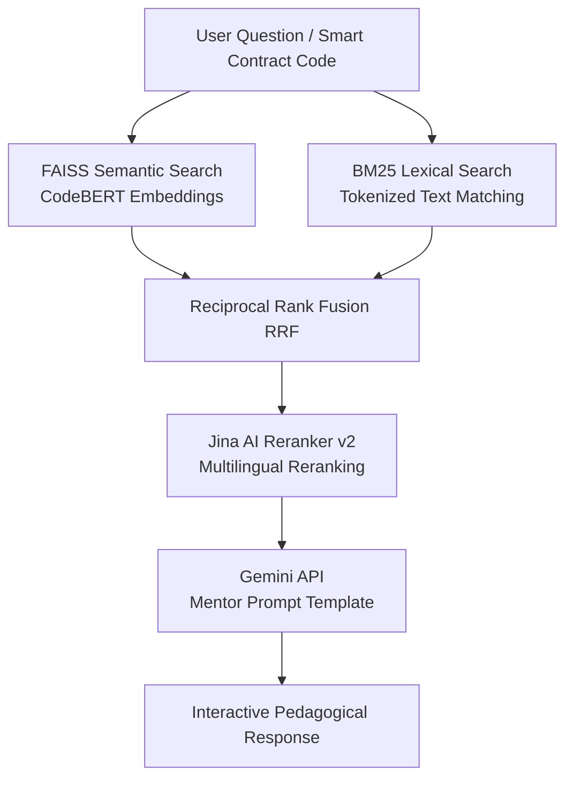

# GenAI Blockchain Security Mentor & Smart Contract Auditor

Hệ thống **Blockchain Security Mentor** và **Smart Contract Auditor** ứng dụng Generative AI kết hợp Hybrid RAG (Retrieval-Augmented Generation). Dự án hỗ trợ người dùng tìm hiểu lỗ hổng bảo mật, giải đáp kiến thức và tự động kiểm thử (audit) Smart Contract trên các mạng blockchain Ethereum và BNB Chain.

---

## Tính năng chính

### 1. AI Security Mentor
* **Giải thích trực quan:** Cung cấp câu trả lời dễ hiểu, sử dụng ẩn dụ thực tế để làm rõ các khái niệm bảo mật phức tạp (ví dụ: lỗi Reentrancy).
* **Cấu trúc phản hồi chuẩn hóa:**
  1. `Khái niệm`: Định nghĩa và ví dụ thực tế.
  2. `Xem xét vấn đề`: So sánh logic mong muốn (Intended) vs. logic thực tế (Actual).
  3. `Kịch bản tấn công`: Chi tiết các bước hacker khai thác lỗ hổng.
  4. `Giải pháp khắc phục`: So sánh trực quan mã nguồn trước và sau khi sửa lỗi (`Before` / `After`).
  5. `Câu hỏi gợi mở`: Câu hỏi tương tác giúp củng cố kiến thức.
* **Streaming & Context:** Hỗ trợ truyền dữ liệu thời gian thực (SSE Streaming) và duy trì ngữ cảnh hội thoại liên tục.

### 2. Pipeline Hybrid RAG
Hệ thống truy xuất tài liệu kết hợp giữa ngữ nghĩa và từ khóa:
* **Semantic Search:** Sử dụng CodeBERT (`microsoft/codebert-base`) kết hợp cơ sở dữ liệu Vector (FAISS/Qdrant).
* **Lexical Search:** Sử dụng thuật toán BM25 định vị chính xác tên hàm và API đặc thù.
* **Độ chính xác cao:** Gộp kết quả bằng Reciprocal Rank Fusion (RRF) và tối ưu xếp hạng bằng Jina Reranker v2.
* **Cơ chế dự phòng:** Tự động hiển thị tài liệu thô từ cơ sở dữ liệu khi Gemini API vượt quá hạn ngạch.



### 3. Smart Contract Security Auditing
* **Tích hợp Explorer API:** Tải trực tiếp mã nguồn Solidity từ Etherscan hoặc BscScan qua địa chỉ hợp đồng.
* **Phân tích mã nguồn:** Hỗ trợ quét và phát hiện lỗ hổng trực tiếp từ mã nguồn Solidity/Vyper do người dùng cung cấp.
* **Phân loại lỗ hổng:** Đánh giá và phân loại mức độ nghiêm trọng từ Low đến Critical.

### 4. Lộ trình học tập tương tác
* **Roadmap trực quan:** Bản đồ học tập bảo mật blockchain từ cơ bản đến nâng cao.
* **Quiz củng cố:** Hệ thống câu hỏi trắc nghiệm tích hợp theo từng bài học.
* **Đồng bộ tiến độ:** Lưu trữ lịch sử và tiến trình học tập theo tài khoản người dùng.

---

## Công nghệ sử dụng (Tech Stack)

### Backend
* **Framework:** FastAPI (Python 3.10+)
* **Database:** MongoDB (Atlas/Local), cơ sở dữ liệu JSON dự phòng.
* **RAG & Vector DB:** Qdrant / FAISS, BM25, CodeBERT Embeddings, Jina Reranker.
* **AI Engine:** Google GenAI SDK (Gemini 2.5 Pro & Gemini 2.5 Flash).
* **Authentication:** JWT (JSON Web Tokens).

### Frontend
* **Framework:** React (Vite) + JavaScript.
* **Styling:** Custom CSS (Dark Cyberpunk theme).
* **Components:** Giao diện Chatbot, Trình soạn thảo mã nguồn, Bản đồ lộ trình dạng cây tương tác.

---

## Cấu trúc thư mục

```text
genai-blockchain-security/
├── backend/                       # Máy chủ FastAPI (Python)
│   ├── api/                       # API Endpoints (Chat, Auth, Contract, Roadmap, Streaming)
│   ├── models/                    # Pydantic v2 Schemas & Database Manager
│   ├── services/                  # RAG & Blockchain explorer integration services
│   └── main.py                    # File khởi chạy server chính
├── frontend/                      # Client React Vite (Javascript)
│   ├── src/
│   │   ├── components/            # UI Components (ChatWindow, Sidebar, Roadmap)
│   │   ├── App.jsx                # Layout và điều phối route chính
│   │   └── index.css              # Custom Dark Cyberpunk Styling
│   └── package.json
├── data/
│   ├── raw/                       # File dữ liệu lỗ hổng JSON gốc
│   ├── processed/                 # Index FAISS/Parquet/BM25 đã build
│   └── local_db/                  # Database dự phòng JSON local
├── src/                           # RAG Core Engines
│   ├── data_preprocessing.py      # Tiền xử lý tập dữ liệu bảo mật
│   ├── ingest_to_vectorstore.py   # Vector hóa dữ liệu đưa vào store
│   └── rag_qa.py                  # Logic RAG, RRF, Reranker và Prompt Gemini
├── .env.example                   # Biến môi trường mẫu
├── requirements.txt               # Các thư viện backend cần thiết
└── docker-compose.yml             # Cấu hình container hóa dự án
```

---

## Cấu hình biến môi trường

Sao chép `.env.example` thành `.env` tại thư mục gốc và cấu hình các thông số sau:

```env
# Gemini API Key (Bắt buộc)
GEMINI_API_KEY=your_gemini_api_key_here

# Chọn Vector Store: "qdrant" hoặc "faiss" (Mặc định: qdrant)
VECTOR_STORE=qdrant
QDRANT_HOST=localhost
QDRANT_PORT=6333
QDRANT_API_KEY=your_qdrant_api_key

# Explorer API Keys (Dành cho việc lấy mã nguồn contract)
ETHERSCAN_API_KEY=your_etherscan_key
BSCSCAN_API_KEY=your_bscscan_key

# MongoDB Atlas / Local
MONGO_URL=mongodb+srv://<username>:<password>@cluster.mongodb.net/
MONGO_DB=genai_blockchain

# Cấu hình server
SERVER_HOST=0.0.0.0
SERVER_PORT=8000
ENV=development
```

---

## Hướng dẫn khởi chạy

### Cách 1: Chạy trực tiếp (Local Development)

#### 1. Khởi chạy Backend (FastAPI):
```bash
# Tạo môi trường ảo
python -m venv .venv

# Kích hoạt môi trường ảo
# Windows (PowerShell):
.venv\Scripts\Activate.ps1
# Windows (CMD):
.venv\Scripts\activate.bat
# Linux/Mac:
source .venv/bin/activate

# Cài đặt thư viện
pip install -r requirements.txt

# Khởi chạy backend
python -m uvicorn backend.main:app --host 0.0.0.0 --port 8000 --reload
```
Tài liệu hướng dẫn API (Swagger UI): `http://localhost:8000/docs`

#### 2. Khởi chạy Frontend (React Vite):
```bash
cd frontend
npm install
npm run dev
```
Truy cập giao diện ứng dụng tại: `http://localhost:5173`

---

### Cách 2: Khởi chạy bằng Docker Compose

Yêu cầu hệ thống đã cài đặt Docker và Docker Compose.

```bash
docker-compose up --build -d
```

Các dịch vụ sẽ được chạy ngầm bao gồm:
1. `genai-blockchain-mongo`: Cơ sở dữ liệu MongoDB.
2. `genai-blockchain-backend`: API Server FastAPI.
3. `genai-blockchain-frontend`: Client React.

---

## Giấy phép

Dự án này được phát triển dưới giấy phép MIT License.
